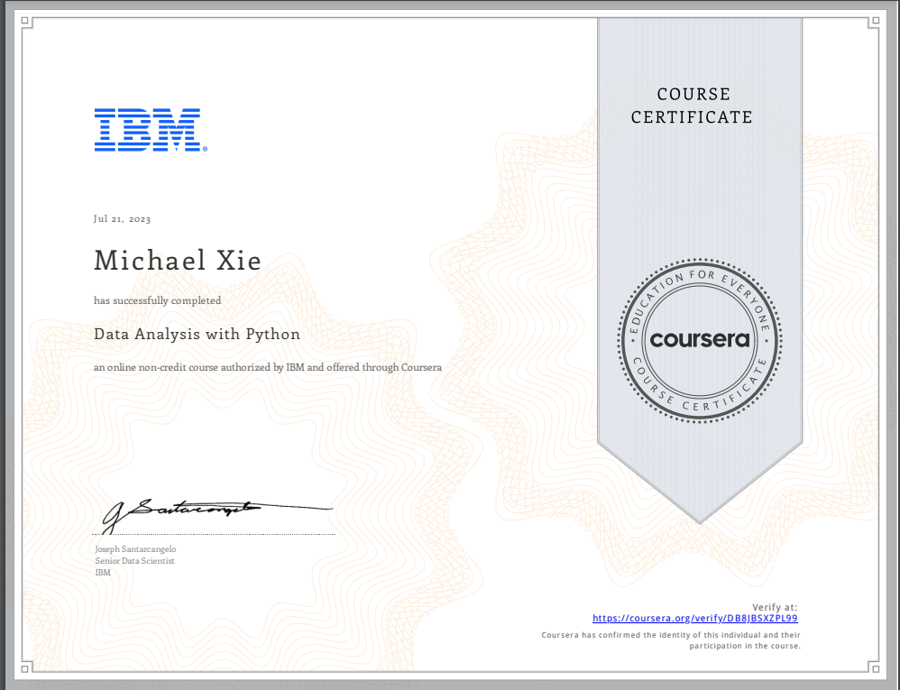

# Data Analysis with Python

## 📄 Summary 
Analyzing data with Python is an essential skill for Data Scientists and Data Analysts. This course will take you from the basics of data analysis with Python to building and evaluating data models.  

You will learn how to import data from multiple sources, clean and wrangle data, perform exploratory data analysis (EDA), and create meaningful data visualizations. You will then predict future trends from data by developing linear, multiple, polynomial regression models & pipelines and learn how to evaluate them.  

In addition to video lectures you will learn and practice using hands-on labs and projects. You will work with several open source Python libraries, including Pandas and Numpy to load, manipulate, analyze, and visualize cool datasets. You will also work with scipy and scikit-learn, to build machine learning models and make predictions.  

If you choose to take this course and earn the Coursera course certificate, you will also earn an IBM digital badge.

## 📑 Main Topics 
- Collecting and Importing Data
- Cleaning, Preparing & Formatting Data
- Data Frame Manipulation
- Summarising Data
- Building Machine Learning Regression Models
- Model Development and Evaluation
- Model Refinement
- Creating Data Pipelines

## 📑 Projects
- [Analysis of Housing Prices for Real Estate](Data%20Analysis%20with%20Python/Week%206/House_Sales_in_King_Count_USA.ipynb) :
In this final assignment, you will assume the role of a Data Analyst working at a real estate investment trust organization who wants to start investing in residential real estate. You will be given a dataset containing detailed information about house prices in the region based on a number of property features, and it will be your job to analyze and predict the market price of houses given that information.

## 🏆 Certificates 
To verify the certificates, click the images to follow the links.

  

