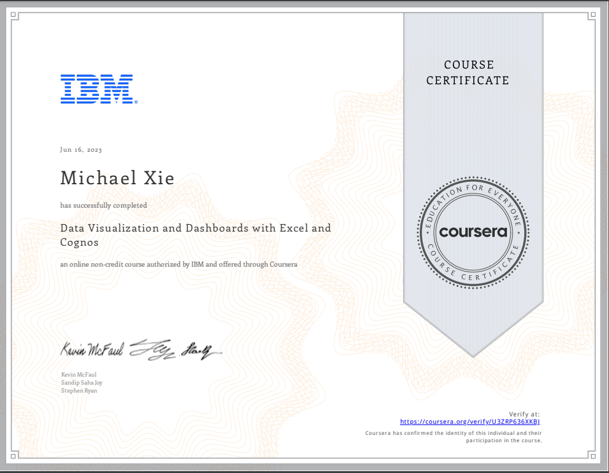

# Data Visualization and Dashboards with Excel and Cognos

## 📄 Summary 
Learn how to create data visualizations and dashboards using spreadsheets and analytics tools. This course covers some of the first steps for telling a compelling story with your data using various types of charts and graphs. You'll learn the basics of visualizing data with Excel and IBM Cognos Analytics without having to write any code. 

You'll start by creating simple charts in Excel such as line, pie and bar charts. You will then create more advanced visualizations with Treemaps, Scatter Charts, Histograms, Filled Map Charts, and Sparklines. Next you’ll also work with the Excel PivotChart feature as well as assemble several visualizations in an Excel dashboard.  

This course also teaches you how to use business intelligence (BI) tools like Cognos Analytics  to create interactive dashboards. By the end of the course you will have an appreciation for the key role that data visualizations play in communicating your data analysis findings, and the ability to effectively create them. 

Throughout this course there will be numerous hands-on labs to help you develop practical experience for working with Excel and Cognos. There is also a final project in which you’ll create a set of data visualizations and an interactive dashboard to add to your portfolio, which you can share with peers, professional communities or prospective employers.

## 📑 Main Topics 
- Visualizing Data Using Spreadsheets
- Creating Visualizations and Dashboards with Spreadsheets
- Creating Visualizations and Dashboards with Cognos Analytics

## 📑 Projects
- [Dashboard Project on Car Sales](Data%20Visualisation%20and%20Dashboards%20with%20Excel%20and%20Cognos/Week%204/Dashboard.pdf/) :
Demonstrate hands-on skills to create visualizations using Excel
Apply hands-on skills to create visualizations and interactive dashboards using Cognos Analytics.
Evaluate the predictive models project developed by your peers using the provided rubric and grading scheme

## 🏆 Certificates 
To verify the certificates, click the images to follow the links.

  

