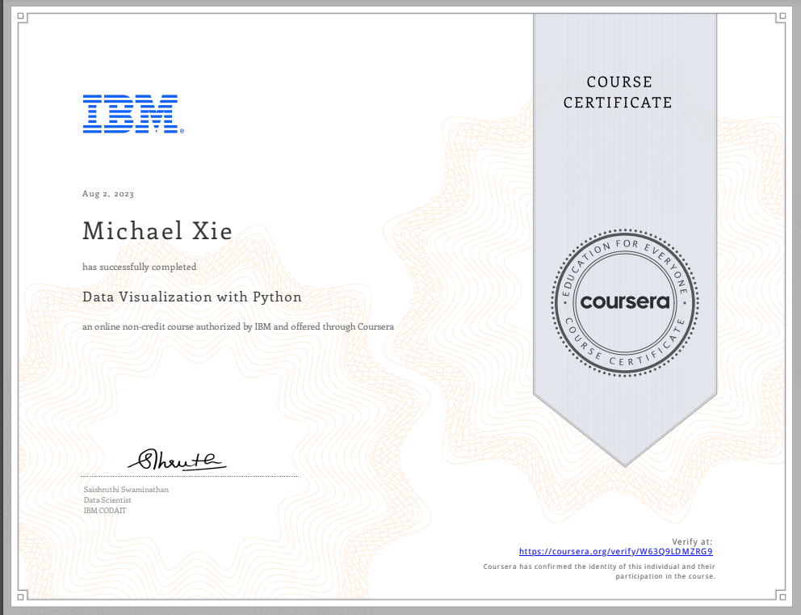

# Data Visualisation with Python 

## 📄 Summary 
One of the most important skills of successful data scientists and data analysts is the ability to tell a compelling story by visualizing data and findings in an approachable and stimulating way. In this course you will learn many ways to effectively visualize both small and large-scale data. You will be able to take data that at first glance has little meaning and present that data in a form that conveys insights. 

This course will teach you to work with many Data Visualization tools and techniques. You will learn to create various types of basic and advanced graphs and charts like: Waffle Charts, Area Plots, Histograms, Bar Charts, Pie Charts, Scatter Plots, Word Clouds, Choropleth Maps, and many more! You will also create interactive dashboards that allow even those without any Data Science experience to better understand data, and make more effective and informed decisions.   

You will learn hands-on by completing numerous labs and a final project to practice and apply the many aspects and techniques of Data Visualization using Jupyter Notebooks and a Cloud-based IDE. You will use several data visualization libraries in Python, including Matplotlib, Seaborn, Folium, Plotly & Dash.

## 📑 Main Topics 
- Data Visualisation Tools
- Specialised Visualisation Tools 
- Advanced Visualisations and Geospatial Data
- Dashboards with Plotly and Dash

## 📑 Projects
- [Analysing the Impact of Recession on Automobile Sales](Data%20Visualisation%20with%20Python/Week%205/Final%20Assignment%20Part2%20Dashboard.py) :
You have been hired by XYZAutomotives as a data scientist. Your first task is to analyze the historical data and give the company directors insights on how the sales were affected during times of recession. You will provide a number of charts/plots to visualize the data and make it easy for the directors to understand your analysis.

  
  

## 🏆 Certificates 
To verify the certificates, click the images to follow the links.

  

