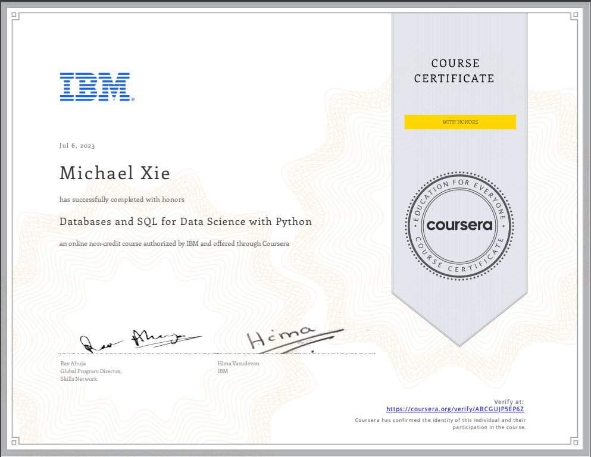

# Databases and SQL for Data Science with Python 

## 📄 Summary 
Working knowledge of SQL (or Structured Query Language) is a must for data professionals like Data Scientists, Data Analysts and Data Engineers. Much of the world's data resides in databases. SQL is a powerful language used for communicating with and extracting data from databases.  

In this course you will learn SQL inside out- from the very basics of Select statements to advanced concepts like JOINs.  

You will:  
-write foundational SQL statements like: SELECT, INSERT, UPDATE, and DELETE 
-filter result sets, use WHERE, COUNT, DISTINCT, and LIMIT clauses 
-differentiate between DML & DDL  
-CREATE, ALTER, DROP and load tables 
-use string patterns and ranges; ORDER and GROUP result sets, and built-in database functions 
-build sub-queries and query data from multiple tables  
-access databases as a data scientist using Jupyter notebooks with SQL and Python 
-work with advanced concepts like Stored Procedures, Views, ACID Transactions, Inner & Outer JOINs 

Through hands-on labs and projects, you will practice building SQL queries, work with real databases on the Cloud, and use real data science tools. In the final project you’ll analyze multiple real-world datasets to demonstrate your skills.

### Labs are undertaken using IBM Db2 database service.

## 📑 Main Topics 
- Relational Databases and Tables
- Intermediate SQL
- Accessing Databases using Python

## 🏆 Honours
This module covers some advanced SQL techniques that will be useful for Data Engineers. In this module, you will learn how to form more powerful queries by using advanced techniques like views, transactions, stored procedures, and joins. 
- Generate joins to query data from multiple tables.
- Create stored procedures and invoke them from other code.
- Describe the significance of ACID transactions.
- Implement transactions in SQL statements.
- Compare and contrast the benefits and disadvantages of using stored procedures.
- Define views and describe the benefits they provide.
- Compare and contrast the different JOIN operators.
- Create and query a view.
## 🏆 Certificates 
To verify the certificates, click the images to follow the links.

  

