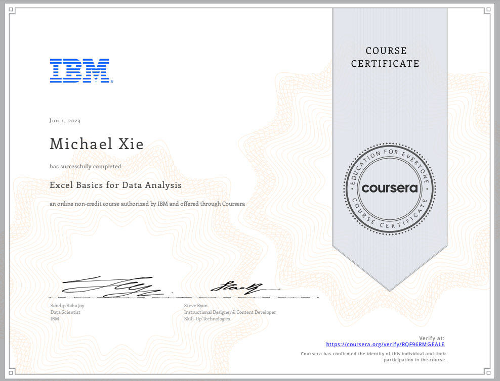

# Excel Basics for Data Analysis 

## 📄 Summary 
Spreadsheet tools like Excel are an essential tool for working with data - whether for data analytics, business, marketing, or research. This course is designed to give a basic working knowledge of Excel and how to use it for analysing data. Throuhg working with data sets and spreadsheets, the course will cover how to perform basic data wrangling and cleansing tasks using functions, as well as the use of filtering, sorting and pivot tables. 

## 📑 Main Topics 
- Introduction to Data Analysis Using Spreadsheets
- Getting Started with Using Excel Speadsheets
- Cleaning & Wrangling Data Using Spreadsheets
- Analyzing Data Using Spreadsheets

## 📑 Projects
- [Excel Project on Fleet Inventory Data](Montgomery_Fleet_Equipment_Inventory_FA_PART_2_END.xlsx/) :
Demonstrate hands-on skills to clean, prepare, and analyze data for a business scenario.
Apply data cleansing and analysis techniques in an Excel spreadsheet.
Evaluate the data analysis project developed by your peers using the provided rubric and grading scheme

## 🏆 Certificates 
To verify the certificates, click the images to follow the links.

  

