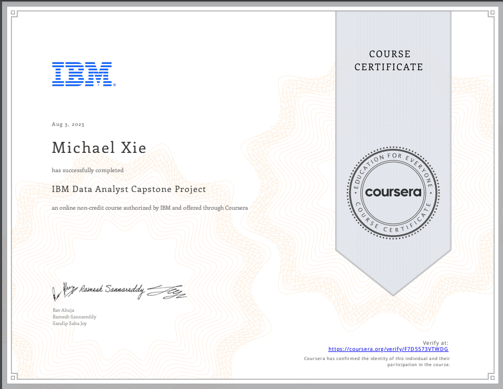

# IBM Data Analyst Capstone Project

## 📄 Summary 
By completing this final capstone project you will apply various Data Analytics skills and techniques that you have learned as part of the previous courses in the IBM Data Analyst Professional Certificate. You will assume the role of an Associate Data Analyst who has recently joined the organization and be presented with a business challenge that requires data analysis to be performed on real-world datasets.  

The project will culminate with a presentation of your data analysis report for various stakeholders in the organization. The report will include an executive summary, your analysis, and a conclusion. You will be assessed on both your work for the various stages in the Data Analysis process, as well as the final deliverable. 

As part of this project you will demonstrate your proficiency with using Jupyter Notebooks, SQL, Relational Databases (RDBMS), Business Intelligence (BI) tools like Cognos, and Python Libraries such as Pandas, Numpy, Scikit-learn, Scipy, Matplotlib, Seaborn and others.  

This project is a great addition to your portfolio and an opportunity to showcase your Data Analytics skills to prospective employers.

## 📑 Main Topics 
- Data Collection from Multiple Sources
- Data Wrangling and Data Preparation
- Exploratory Data Analysis
- Statistical Analysis and Data Mining
- Data Visualisation with Different Charts and Plots
- Interactive Dashboard Creation 

## 📑 Projects
- [Technology Survey Analytics](IBM%20Data%20Analyst%20Capstone%20Project/Week%206/Final%20Presentation.pdf) :
Data insights into demographics of employees in IT sector, as well as popularity of IT coding languages and frameworks. 

## 🏆 Certificates 
To verify the certificates, click the images to follow the links.

  

