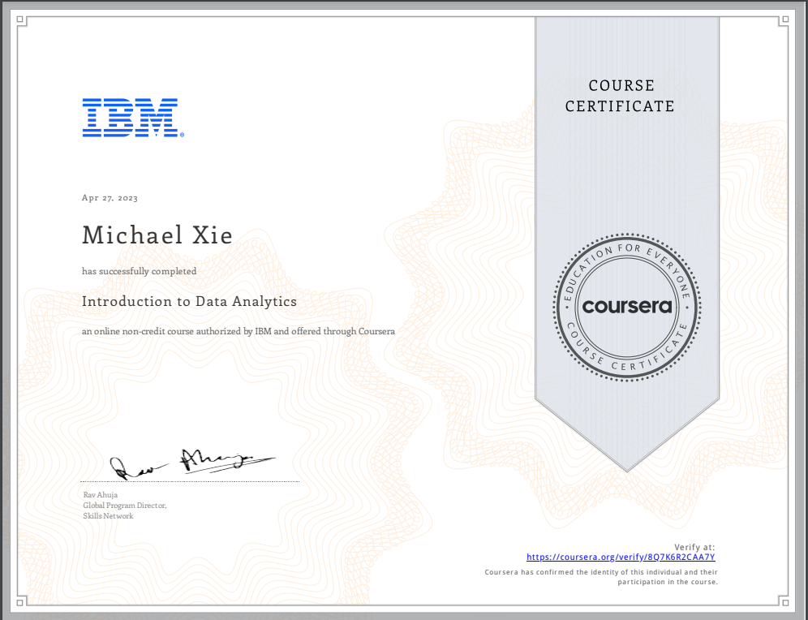

# Introduction To Data Analytics

## 📄 Summary 
This course presents a gentle introduction to Data Analysis, the role of a Data Analyst, and the tools used in this job. It teaches about the skills and responsibilities of a data analyst. This course will help you to differentiate between the roles of Data Analysts, Data Scientists, and Data Engineers. 

## 📑 Main Topics 
- What is Data Analytics
- The Data Ecosystem
- Gathering and Wrangling Data
- Mining & Visualizing Data and Communicating Results
- Career Opportunities and Data Analysis in Action

## 🏆 Certificates 
To verify the certificates, click the images to follow the links.

  

