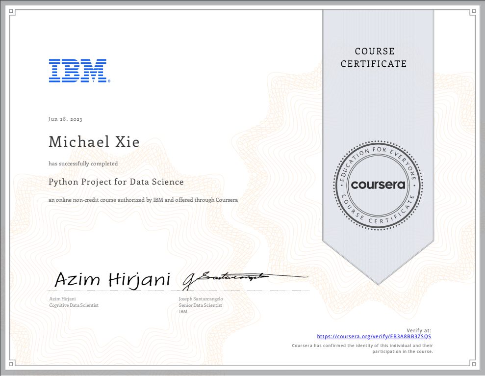

# Python Project for Data Science

## 📄 Summary 
This mini-course is intended to for you to demonstrate foundational Python skills for working with data. This course primarily involves completing a project in which you will assume the role of a Data Scientist or a Data Analyst and be provided with a real-world data set and a real-world inspired scenario to identify patterns and trends. 

You will perform specific data science and data analytics tasks such as extracting data, web scraping, visualizing data and creating a dashboard. This project will showcase your proficiency with Python and using libraries such as Pandas and Beautiful Soup within a Jupyter Notebook. Upon completion you will have an impressive project to add to your job portfolio.   

## 📑 Main Topics 
- Crowdsourcing Short squeeze Dashboard
- Webscraping 
- BeautifulSoup

## 📑 Projects
- [Analysing Stock Performance and Building a Dashboard](Montgomery_Fleet_Equipment_Inventory_FA_PART_2_END.xlsx/) :
For this project, you will assume the role of a Data Scientist / Data Analyst working for a new startup investment firm that helps customers invest their money in stocks. Your job is to extract financial data like historical share price and quarterly revenue reportings from various sources using Python libraries and webscraping on popular stocks. After collecting this data you will visualize it in a dashboard to identify patterns or trends. The stocks we will work with are Tesla, Amazon, AMD, and GameStop.

  
  

## 🏆 Certificates 
To verify the certificates, click the images to follow the links.

  

