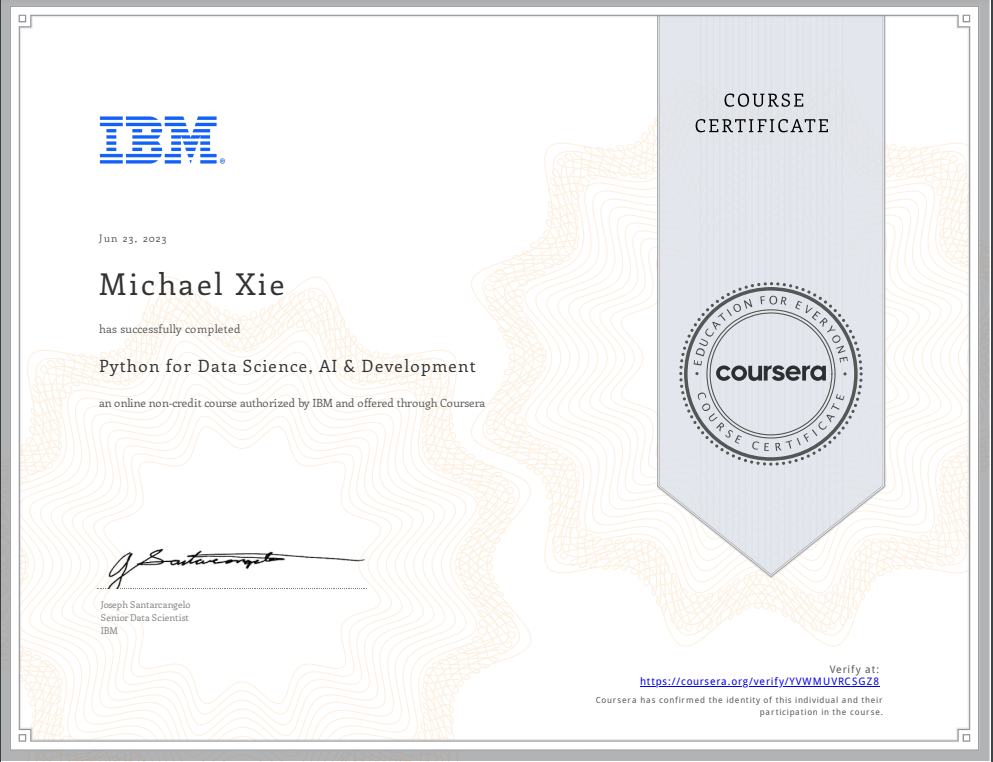

# Python for Data Science, AI & Development

## 📄 Summary 
This introduction to Python course will take you from zero to programming in Python in a matter of hours—no prior programming experience necessary! You will learn about Python basics and the different data types. You will familiarize yourself with Python Data structures like List and Tuples, as well as logic concepts like conditions and branching. You will use Python libraries such as Pandas, Numpy & Beautiful Soup. You’ll also use Python to perform tasks such as data collection and web scraping with APIs.  

You will practice and apply what you learn through hands-on labs using Jupyter Notebooks. By the end of this course, you’ll feel comfortable creating basic programs, working with data, and automating real-world tasks using Python.  

This course is suitable for anyone who wants to learn Data Science, Data Analytics, Software Development, Data Engineering, AI, and DevOps as well as a number of other job roles.

### Labs Completed in Skills Network Labs Environment 

## 📑 Main Topics 
- Plotly
- Data Structures
- Working with Data in Python
- APIs, and Data Collection

## 🏆 Certificates 
To verify the certificates, click the images to follow the links.

  

